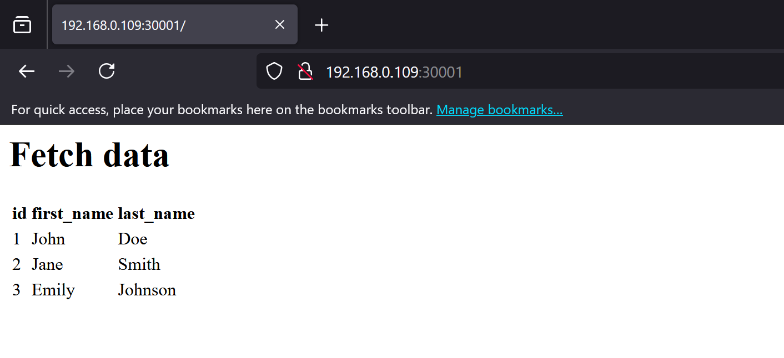
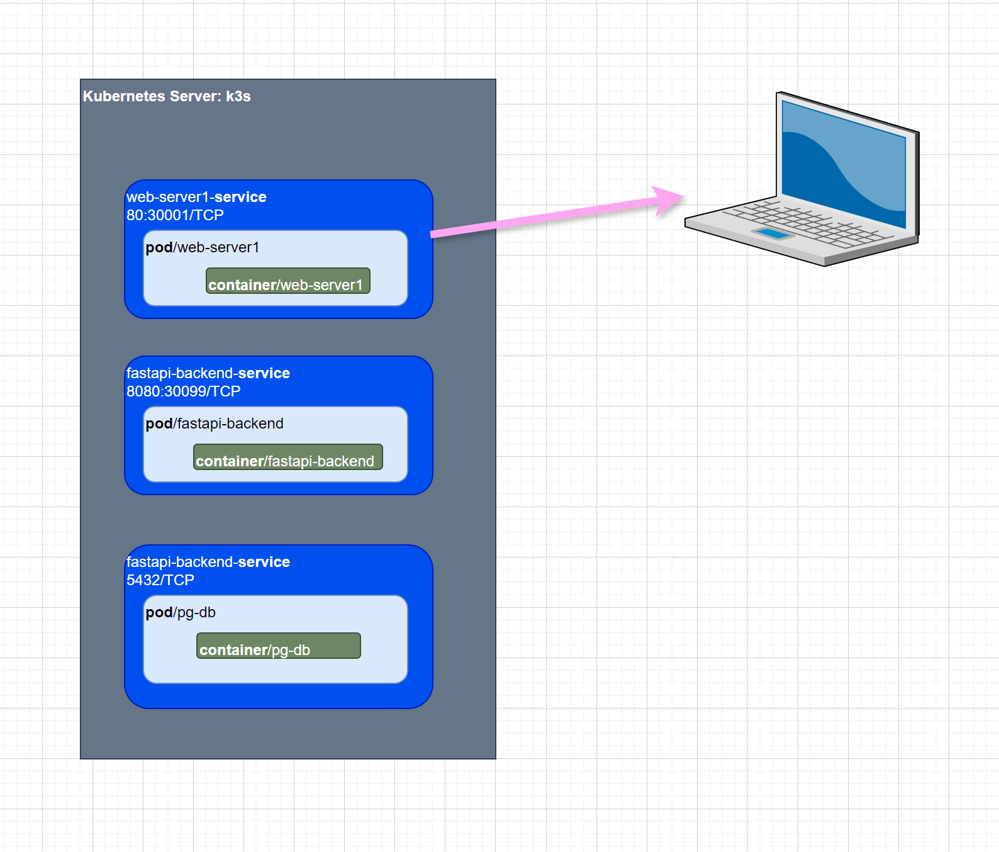

### Step-by-Step Guide to Building Your Web Application

This tutorial will guide you through building a full-stack web application with the components you requested, using Kubernetes, Docker, Python, FastAPI, PostgreSQL, Let's Encrypt, CloudFlare, and Vue.js.

## Install Kubernetes K3s and Docker 
[Installation instruction is provided in another wiki page](K3S-Kubernetes-Installation-and-Configuration)

## First setup namespace and service account 

- cd to kubernetes-administration directory
- Run the following deployment files to create namespace that our applications will be using inside Kubernetes environment.

  ```bash
  kubectl apply -f namespace-serviceaccount.yaml 
  ```
  **NOTE**: If you receive a service account 'default' not found or something, please uncomment lines in yaml file and run it again.

  Check if namespace was created

```bash
  > kubectl get namespaces
  NAME              STATUS   AGE
  barebone-html     Active   2m52s
  default           Active   5d5h
  kube-node-lease   Active   5d5h
  kube-public       Active   5d5h
  kube-system       Active   5d5h
```

## Set Up PostgreSQL Database**

1. **Create a Dockerfile for PostgreSQL**:

    ```dockerfile
      FROM postgres:14
      ENV POSTGRES_USER=myuser
      ENV POSTGRES_PASSWORD=mypassword
      ENV POSTGRES_DB=mydatabase

      COPY init.sql /docker-entrypoint-initdb.d/
    ```

2. **Create an `init.sql` file**:
   ```sql
    -- Create the persons table
    CREATE TABLE persons (
        id SERIAL PRIMARY KEY,
        first_name VARCHAR(50),
        last_name VARCHAR(50)
    );

    -- Insert three test rows into the persons table
    INSERT INTO persons (first_name, last_name) VALUES ('John', 'Doe');
    INSERT INTO persons (first_name, last_name) VALUES ('Jane', 'Smith');
    INSERT INTO persons (first_name, last_name) VALUES ('Emily', 'Johnson');

   ```

**Build and Push the PostgreSQL Docker Image**:

Change directory to 'dbserver' and invoke following commands.

```bash
  docker build -t iyusuf/dbserver  -f Dockerfile-db .
  docker tag iyusuf/dbserver  iyusuf/dbserver:latest
  docker push iyusuf/dbserver:latest

  kubectl apply -f database-pg-db.yaml
```
**Verify database in Kubernetes**

```bash
  ❯ k get services -n barebone-html
  NAME            TYPE        CLUSTER-IP     EXTERNAL-IP   PORT(S)    AGE
  pg-db-service   ClusterIP   10.43.82.122   <none>        5432/TCP   3m8s
```

**[OPTIONAL] Run Postgres**

If you want to make sure Postgres container image is error free only then do this step.

Run the container using the updated image:

```bash
    docker run --name pg-db -d iyusuf/pg-db:v1
```

**Verify the Rows**

To verify that the test rows were inserted correctly:

1. **Connect to the PostgreSQL Database**:
   
```bash
    docker exec -it pg-db psql -U myuser -d mydatabase
```


## **Set Up FastAPI Backend**

Detail of how Python and FastAPI was developed is in the following document. If you need to know more about how 'fastapi-backend' Kubernetes service was built from Python and Docker click the following link. 
**[Detail of FastAPI Backend is in this link](README_fastapi.md)**

Assuming you have generated required Docker images and Python files please follow following instruction to deploy to Kubernetes. 

**Build and Push the FastAPI Docker Image**:

```bash
  docker build -t fastapi-backend -f Dockerfile .
  docker tag fastapi-backend iyusuf/fastapi-backend:latest
  docker push iyusuf/fastapi-backend:latest
  # Apply the kubernetes deployment
  kubectl apply -f deployment.yaml
```
Verify services got deployed to Kubernetes

   ```bash
  ❯ k get services -n barebone-html
  NAME                      TYPE        CLUSTER-IP      EXTERNAL-IP   PORT(S)          AGE
  fastapi-backend-service   NodePort    10.43.175.125   <none>        8080:30099/TCP   8s
  pg-db-service             ClusterIP   10.43.82.122    <none>        5432/TCP         20m
   ```

## **Set Up a barebone HTML and pure Javascript based Web App**
- I used ChatGPT to generate a simple HTML page. The HTML page uses Javascript fetch function to get data from Postgres that is running as Kubernetes service 
- I will not elaborate on how the app functions since web-page app was extremely simple. 
- Files located in web-page folder are self explanatory.

- Deploy web-page to Kubernetes

```bash
  #Web server 1 deployment
  docker build -t web-server1-image -f Dockerfile .
  docker tag web-server1-image iyusuf/web-server1-image:latest
  docker push iyusuf/web-server1-image:latest

  # Deploy to Kubernetes
  kubectl apply -f deployment1.yaml
```

## Test

- Find Kubernetes node ip.

```bash
❯ kubectl get nodes -o wide
NAME          STATUS   ROLES                  VERSION        INTERNAL-IP     EXTERNAL-IP   OS-IMAGE             
lenovom910q   Ready    control-plane,master   v1.30.4+k3s1   192.168.0.109   <none>        Ubuntu 22.04.4 LTS   
```

- Use a browser to go to 
http://<IP of the Node>:<nodePort: 30001>/

- In my example it was:
http://192.168.0.109:30001

- Sample Screen Shot of Browser Output


- Sample deployment diagram.
